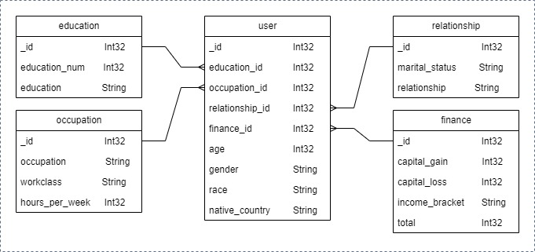

# MongoDB Data Warehouse Construction

ETL-Driven Approach for Efficient Data Management

Welcome to the MongoDB Data Warehouse Construction repository!

This project serves as an in-depth guide for building a dynamic Data Warehouse using MongoDB as the foundation. Through Extract, Transform, Load (ETL) processes and thoughtful database design, this repository empowers you to efficiently manage and analyze your data, ensuring optimal insights for your organization's growth.

## Repository Contents

### 1. Database Design and Entity-Relationship Diagram (ERD)

Immerse yourself in the fundamentals of designing MongoDB databases. Learn how to create an effective Entity-Relationship Diagram (ERD) that captures the relationships between collections, setting the stage for a well-structured Data Warehouse.



### 2. ETL Script for Data Loading

Uncover the power of ETL by utilizing provided scripts to seamlessly extract data from external sources (CSV files) and transform it into MongoDB-ready formats. Discover how to load this data into MongoDB collections efficiently.

Import data from `USAdultIncome.csv` file to mongodb

```cmd
mongoimport --type csv -d DWDB -c USAdultIncome --headerline --drop --file USAdultIncome.csv
```

Run mongodb shell

```sh
mongosh
use DWDB
```

Load data to Education Collection by using Javascript

```sh
load("loadEducation.js")
loadEducation()
```

Load data to Finance Collection by using Javascript

```sh
load("loadFinance.js")
loadFinance()
```

Load data to Occupation Collection by using Javascript

```sh
load("loadOccupation.js")
loadOccupation()
```

Load data to Relationship Collection by using Javascript

```sh
load("loadRelationship.js")
loadRelationship()
```

Load data to User Collection by using Javascript

```sh
load("loadUser.js")
loadUser()
```

### 3. Aggregating Data for Analysis

Dive into the world of data aggregation within MongoDB. Understand how to use MongoDB's aggregation framework to perform advanced calculations, grouping, and data manipulations, enhancing your ability to generate insightful reports.

**aggregate01**: How many are female and work more than `30` hours per week?

- Aggregation Pipeline Stages: `aggregate( $match, $lookup, $project, $unwind, $count )`

**aggregate02**: How many people in the US have an income > `50K` ?

- Aggregation Pipeline Stages: `aggregate( $match, $lookup, $unwind, $count )`

**aggregate03**: Calculate the total account balances of people who are in the US.

- Aggregation Pipeline Stages: `aggregate( $match, $lookup, $unwind, $group )`

**aggregate04**: Calculate the total number of working hours a week of people with income <= 50K

- Aggregation Pipeline Stages: `aggregate( $match, $lookup, $unwind, $group )`

**aggregate05**: Find people with total account balance > 100000 and weekly working hours < 55.

- Aggregation Pipeline Stages: `aggregate( $match, $lookup, $unwind )`

### 4. Indexing Strategies for Enhanced Performance

Explore the importance of indexing within MongoDB collections for improved query performance. Learn how to strategically create indexes on fields to accelerate data retrieval and aggregation processes.

## Usage

- Clone or fork this repository to access invaluable resources for constructing a MongoDB-based Data Warehouse.
- Study the database design principles and ERD creation techniques to ensure your collections are optimally structured.
- Use the provided ETL scripts to extract, transform, and load data from CSV files into MongoDB collections.
- Master data aggregation using the MongoDB aggregation framework to generate valuable insights from your stored data.
- Implement indexing strategies learned in the repository to optimize query performance for swift data retrieval.

## Contributions

Contributions to this repository are highly encouraged. If you have insights, improvements, or additional scripts related to MongoDB Data Warehousing, ETL processes, or indexing strategies, feel free to submit pull requests. Collaboratively, we can build a valuable resource for data professionals.

Embark on your journey of building a MongoDB-powered Data Warehouse through ETL and smart database design. Elevate your data management and analysis capabilities with MongoDB's flexible and powerful features.

Happy data warehousing! 🏢📊
